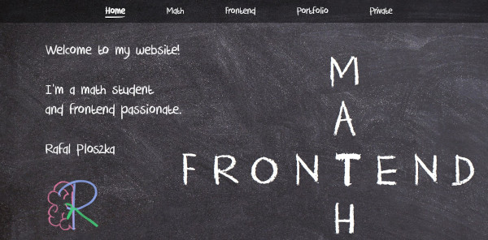

# My personal website (with React)
  
My personal website using React (react router, react rotuer transtion). In consists of 5 sections:
* homepage
* math section (about my studies, math tutoring and mathematical areas of interests)
* frontend section (about my skills, objectives and courses in frontend programming)
* portofolio (the overview of my projects)
* private (some photos of the people most important to me)

## Demo
To view a demo [click here](https://rafal-ploszka-website.herokuapp.com/).

## Getting started
Clone down this repo. You will need node and npm installed globally on your machine.

`npm start` runs the app in the development mode.

Open http://localhost:3000 to view it in the browser and get to know me better :) 

## Author
Rafał Płoszka
